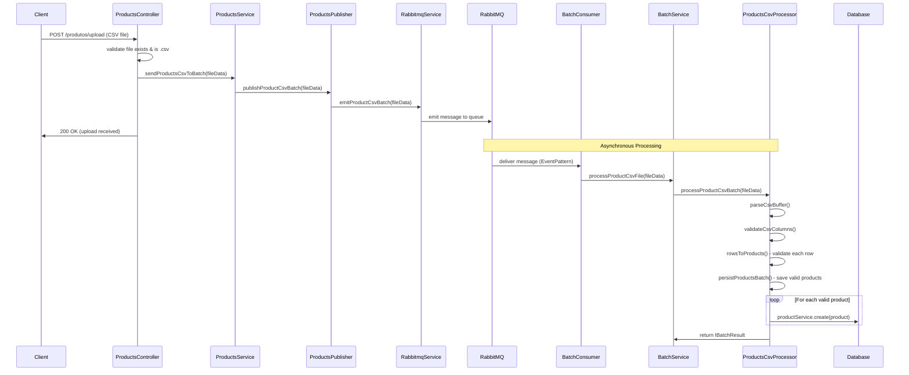

# Sistema de Registro de Produtos - API

API RESTful desenvolvida em NestJS para processamento de arquivos CSV para persistir produtos em lote com PostgreSQL e RabbitMQ.

## Funcionalidades

- Upload de arquivos CSV via endpoint REST
- Processamento em lote com RabbitMQ
- Validação de dados com class-validator
- Persistência apenas de registros válidos
- Prevenção de duplicatas
- Testes unitários com Jest
- Listagem de produtos via endpoint REST

## Pré-requisitos

- Node.js v16 ou superior
- PostgreSQL v13 ou superior
- RabbitMQ v3.8 ou superior
- Docker (opcional, para infraestrutura)

## Instalação

```bash
# Clone o repositório
git clone <url-do-repositorio>
cd teste-node-credito/server

# Instale as dependências
npm install
```

### Configurar ambiente
```bash
cp example.env .env
# Edite o .env com suas configurações
```

### Subir infraestrutura com Docker (Recomendado)
```bash
# Na raiz do projeto
docker compose up -d
```

### Executar aplicação (local)
```bash
npm run start:dev
```

### Executar testes
```bash
npm run test
npm run test:cov
```

## Acesso local
- API: http://localhost:3000
- RabbitMQ Management: http://localhost:15672 (user: user, pass: password)
- PostgreSQL: localhost:5432

## Estrutura do Projeto

```
src/
├── app.module.ts              # Módulo raiz da aplicação
├── main.ts                    # Inicialização da aplicação
├── app.module.ts              # Configuração geral da aplicação
├── product/                   # Módulo de Produtos
│   ├── products.controller.ts # Endpoints REST
│   ├── products.service.ts    # Lógica de negócio
│   ├── products.entity.ts     # Entidade TypeORM
│   ├── products.module.ts     # Configuração do módulo
│   ├── dto/
│   │   └── products.request.dto.ts # DTOs de validação
│   └── publisher/
│       └── product.publishers.ts   # Publisher RabbitMQ
├── batch/                     # Módulo de Processamento em Lote
│   ├── batch.service.ts       # Orquestrador de processamento
│   ├── batch.module.ts        # Configuração do módulo
│   ├── consumer/
│   │   └── batch.consumer.ts  # Consumer RabbitMQ
│   ├── processor/
│   │   └── products-csv.processor.ts # Processador CSV para produtos
│   └── dto/                   # Interfaces de lote
├── infra/                     # Infraestrutura
│   └── rabbitmq/
│       ├── rabbitmq.service.ts    # Serviço RabbitMQ
│       ├── rabbitmq.config.ts     # Configurações de filas
│       ├── rabbitmq.constants.ts  # Constantes (filas)
│       └── rabbitmq.module.ts     # Módulo RabbitMQ
└── common/                    # Utilitários Compartilhados
    ├── exceptions/            # Exceções customizadas
    ├── filters/               # Filtros globais
    ├── interfaces/            # Contratos de serviços
    └── utils/                 # Utilitários (CSV, DB)
```

### Responsabilidades dos Módulos

- **ProductsModule**: 
  - `ProductsController`: Endpoints REST (upload, listar produtos)
  - `ProductsService`: Lógica de negócio e persistência direta
  - `ProductsPublisherProcessor`: Publicação de mensagens para RabbitMQ
  - `ProductsEntity`: Entidade TypeORM do produto

- **BatchModule**: 
  - `BatchConsumer`: Consumer RabbitMQ que escuta fila de processamento
  - `BatchService`: Orquestrador do processamento de arquivos
  - `ProductsCsvProcessor`: Processamento específico de CSV de produtos

- **RabbitmqModule**: 
  - `RabbitmqService`: Serviço para emissão de mensagens
  - Configurações de filas e conexões

- **Common**: 
  - Utilitários (CSV parsing, validação, database helpers)
  - Exceções customizadas
  - Interfaces e contratos de serviços
  - Filtros globais de exceção

## API Endpoints

### POST `/produtos/upload`

Recebe arquivo CSV para cadastro de produtos em lote.

```bash
curl -X POST http://localhost:3000/produtos/upload \
  -F "file=@./exemplo.csv" \
  -H "Content-Type: multipart/form-data"
```

Response:
```json
{
  "message": "Arquivo recebido com sucesso e enviado para processamento",
  "filename": "exemplo.csv"
}
```

**Formato CSV esperado:**
```csv
nome,descricao,preco
"Caneta Azul","Esferográfica ponta fina",2.50
"Caderno","96 folhas",12.90
```

**Validações aplicadas:**
- `nome`: obrigatório, string, máximo 100 caracteres
- `preco`: obrigatório, número positivo
- `descricao`: opcional, string  
- Colunas obrigatórias no CSV: `nome`, `preco`
- Produtos duplicados (mesmo nome) são rejeitados
- Linhas com erros de validação são registradas nos logs mas não interrompem o processamento

### GET `/produtos`
Lista todos os produtos cadastrados.

```bash
curl -X GET http://localhost:3000/produtos
```

**Response:**
```json
[
  {
    "id": "550e8400-e29b-41d4-a716-446655440000",
    "nome": "Caneta Azul",
    "descricao": "Esferográfica ponta fina",
    "preco": 2.50
  },
  {
    "id": "550e8400-e29b-41d4-a716-446655440001",
    "nome": "Caderno",
    "descricao": "96 folhas",
    "preco": 12.90
  }
]
```

## Arquitetura RabbitMQ

O sistema utiliza RabbitMQ para desacoplar o upload do processamento, proporcionando:

- **Escalabilidade**: Múltiplos consumers podem processar arquivos
- **Resiliência**: Filas duráveis garantem que mensagens não sejam perdidas  
- **Performance**: Upload não bloqueia enquanto processa arquivo
- **Processamento Tolerante a Falhas**: Erros em produtos individuais não param o processamento do lote completo

### Comportamento do Processamento

- **Processamento Individual**: Cada produto é processado e persistido separadamente
- **Falha Parcial**: Se alguns produtos falharem na validação/persistência, os válidos continuam sendo salvos
- **Logging Detalhado**: Todos os sucessos e falhas são registrados com contexto completo
- **Resposta Imediata**: Cliente recebe confirmação de upload antes do processamento começar
- **Fila Durável**: Arquivos não são perdidos mesmo se o sistema for reiniciado

### Fluxo de Mensagens

1. Cliente faz POST /produtos/upload
2. ProductsController (Valida se é um .csv) → ProductsService → ProductsPublisherProcessor → RabbitmqService
3. RabbitmqService publica mensagem na fila RabbitMQ
4. Controller retorna resposta imediata ao cliente
5. BatchConsumer escuta fila e recebe mensagem
6. BatchConsumer → BatchService → ProductsCsvProcessor
7. ProductsCsvProcessor processa CSV, valida dados e persiste produtos válidos
8. Logs são gerados para acompanhar sucesso/erros do processamento

### Configuração das Filas

```typescript
export const RABBITMQ_QUEUES = {
  PRODUCT_CSV_BATCH_QUEUE: 'product_csv_batch_queue',
};

export const rabbitmqConfigs = {
  PRODUCT_CSV_BATCH_QUEUE: {
    urls: [process.env.RABBITMQ_URL],
    queue: RABBITMQ_QUEUES.PRODUCT_CSV_BATCH_QUEUE,
    queueOptions: {
      durable: true,
    },
  },
};
```

### Fluxo de Mensagens



### Estrutura da Mensagem

```typescript
interface ICsvFileData {
  filename: string;
  buffer: Buffer;
  options?: {
    separator?: string;
  };
}

interface IBatchResult<T> {
  successCount: number;
  errorCount: number;  
  errors: IBatchError<T>[];
}

interface IBatchError<T> {
  item: T;
  error?: string;
  validationErrors?: ValidationError[];
}
```

### Monitoramento

Acesse o **RabbitMQ Management Console** em http://localhost:15672:

- **Filas**: Visualize quantidade de mensagens
- **Consumers**: Verifique consumers ativos
- **Rates**: Monitore throughput de mensagens
- **Connections**: Acompanhe conexões ativas

## Licença

Este projeto é disponibilizado apenas para fins de avaliação técnica.
